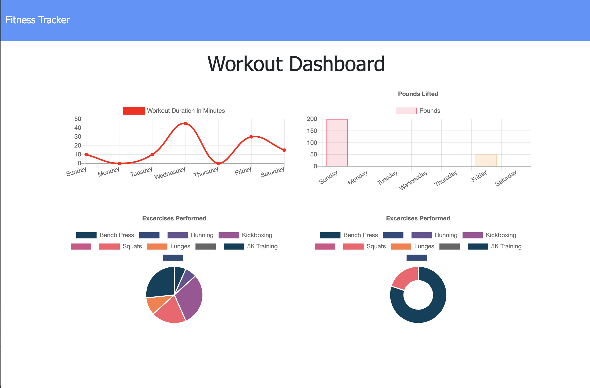

# Fitness-Tracker

## Description
 This app allows the user to view create and track daily workouts. They can log multiple exercises in a workout on a given day. When they load the page, they should be given the option to create a new workout or continue with your last workout. They will also be shown a stats page with graphs illustrating their progress.
## Table of Contents
- [Description](#description)
- [Installation](#installation)
- [Usage](#usage)
- [License](#license)
- [Contributing](#contributing)
- [Tests](#tests)
- [Questions](#questions)
## Installation
Mongo database with a Mongoose schema. Uses MongoDB, Node and Express.
## Usage
A consumer will reach their fitness goals more quickly when they track their workout progress. Always nice to track progress. They should also be able to track the name, type, weight, sets, reps, and duration of exercise. If the exercise is a cardio exercise, they should be able to track my distance traveled. 

 

## License
ISC
## Contributing
[Alexandra Hionis](https://github.com/Alexandra-Hionis/README-Generator)
## Tests
No tests were used
## Questions
GitHub: https://github.com/Alexandra-Hionis  
Email: Alexandra.hionis@gmail.com  
